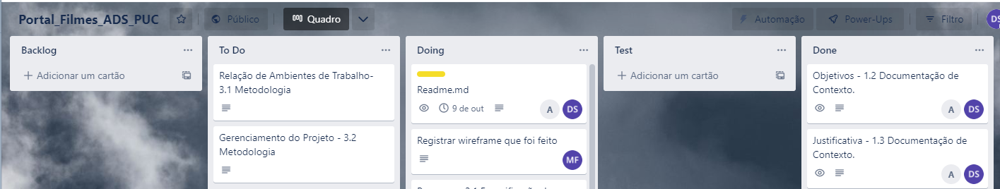

# Metodologia

## Documentação de Especificação

Os artefatos do projeto são desenvolvidos a partir de diversas plataformas e a relação dos ambientes com seu respectivo propósito é apresentada na tabela que se segue. 

|Ambiente|Plataforma|Link de Acesso|
|-|-|-|
|Repositório de Codigo Fonte|GitHub|https://github.com/ICEI-PUC-Minas-PMV-ADS/pmv-ads-2022-2-e1-proj-web-t10-portal_filmes_ads_puc|
|Documentos do projeto|Google Drive|https://drive.google.com/drive/folders/1B0RlajZc1mgcePINeRV8zj4yo6uOyB31?usp=sharing|
|Projeto de Interface e  Wireframes|MarvelApp|https://marvelapp.com/prototype/2gf88076|
|Gerenciamento do Projeto|Trello|https://trello.com/invite/b/SMdxpaDR/09ceee9d0dbbed6805c002094fc5e768/portalfilmesadspuc|

## Gerenciamento do Projeto
A equipe utiliza metodologias ágeis, tendo escolhido o Scrum como base para definição do processo de desenvolvimento.
> **A equipe está organizada da seguinte maneira**:
> - `Scrum Master`: Andréa Medeiros Aragão da Silveira
> - `Product Owner`: Douglas Garcia da Silveira
> - `Equipe de Desenvolvimento`:
>   - Adonias de Almeida Sobrinho
>   - Marcos Henrique Aguiar França
> - `Equipe de Design`:
>   - Marcelo Henrique Ferreira

Para organização e distribuição das tarefas do projeto, a equipe está utilizando o Trello estruturado com as seguintes listas:

- `Backlog`: recebe as tarefas a serem trabalhadas e representa o Product Backlog. Todas as atividades identificadas no decorrer do projeto também devem ser incorporadas a esta lista.

- `To Do`: Esta lista representa o Sprint Backlog. Este é o Sprint atual que estamos trabalhando.

- `Doing`: Quando uma tarefa tiver sido iniciada, ela é movida para cá.

- `Test`: Após desenvolvido, serão testados/certificados que está em funcionamento.

- `Done`: nesta lista são colocadas as tarefas que passaram pelos testes e controle de qualidade e estão prontos para ser entregues ao usuário. Não há mais edições ou revisões necessárias, ele está agendado e pronto para a ação.

O quadro kanban do grupo desenvolvido na ferramenta de gerenciamento de projetos através da plataforma Trello é apresentado, no estado atual, na figura abaixo.

