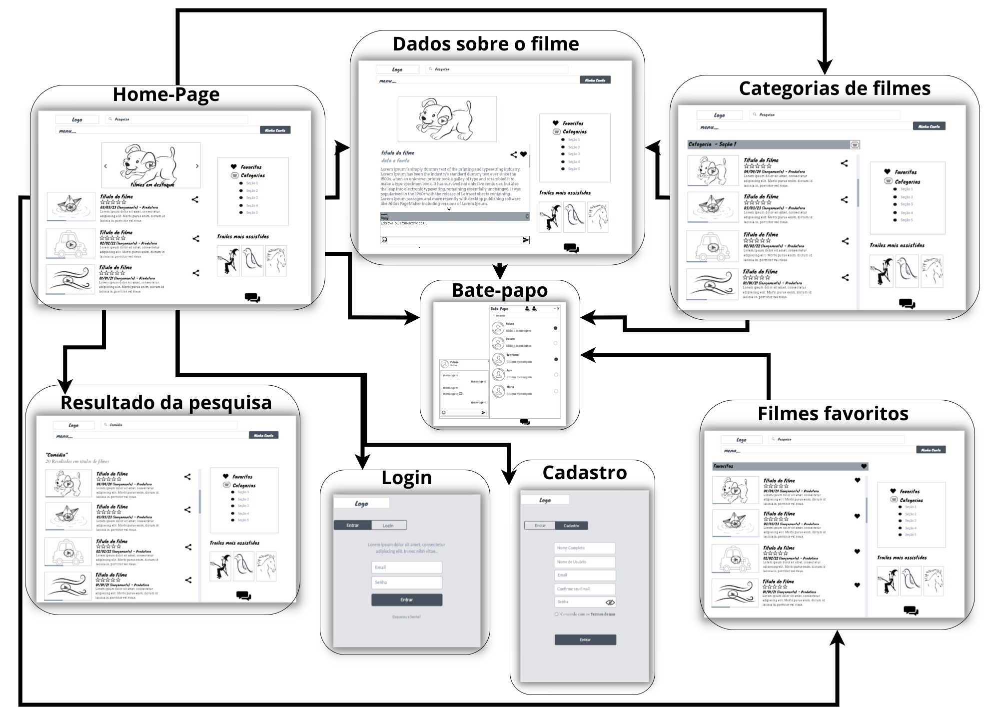
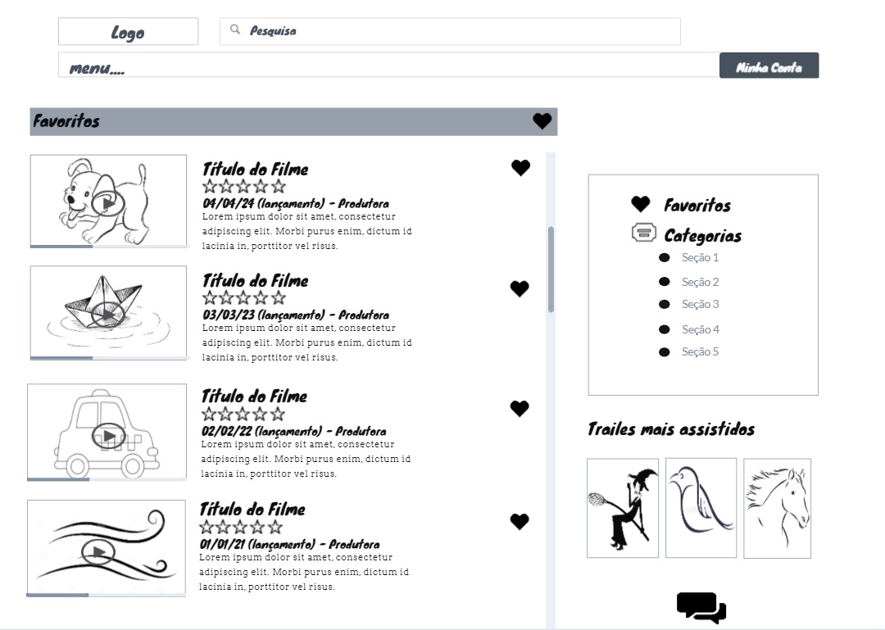
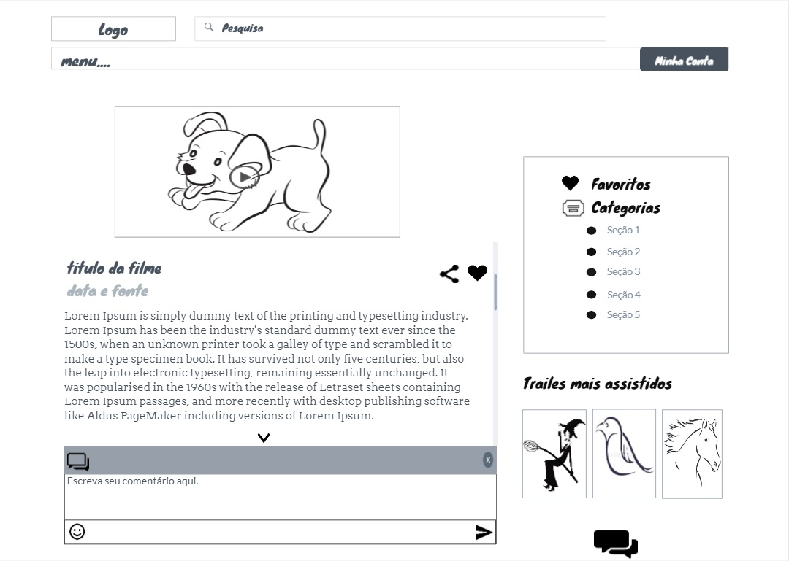
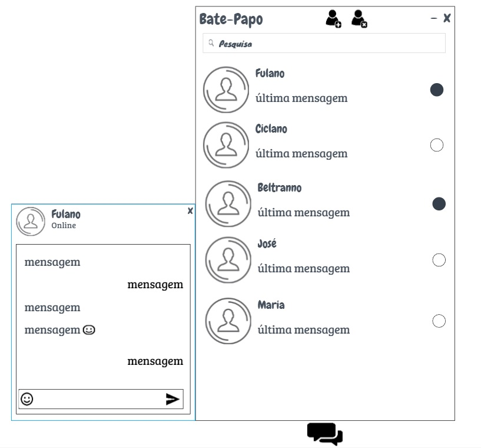
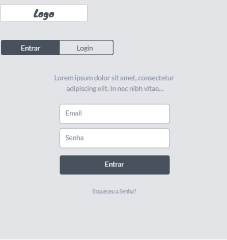

# Projeto de Interface

Dentre as preocupações para a montagem da interface do sistema, estamos estabelecendo foco em questões como agilidade, acessibilidade e usabilidade. Desta forma, o projeto tem uma identidade visual padronizada em todas as telas que são projetadas para funcionamento em desktops e dispositivos móveis.

# Fluxo do Usuário

O diagrama apresentado abaixo (Figura 02) mostra o fluxo de interação do usuário pelas telas do sistema. Cada uma das telas deste fluxo é detalhada na seção de Wireframes que se segue. Para visualizar o wireframe interativo, acesse o ambiente [MarvelApp do projeto](https://marvelapp.com/prototype/2gf88076).

Figura 02 - Fluxo do Usuário

# Wireframes

Conforme fluxo de telas do projeto, apresentado no item anterior, as telas do sistema são apresentadas em detalhes nos itens que se seguem. As telas do sistema apresentam uma estrutura comum que é apresentada na imagem abaixo (Figura 03). Nesta estrutura, existem 3 grandes blocos, descritos a seguir. São eles:

Figura 03 - Modelo do site

> -	Cabeçalho - local onde são dispostos elementos fixos de identidade (logo) e navegação principal do site (menu da aplicação);
> -	Conteúdo - apresenta o conteúdo da tela em questão;
> -	Barra lateral - apresenta os elementos de navegação secundária, geralmente associados aos elementos do bloco de conteúdo.

# Tela - Home-Page

A tela de home-page (Figura 04) mostra notícias de destaque a partir da API utilizada pelo sistema. 
Com base na estrutura padrão, o bloco de Conteúdo traz as notícias em destaque (imagem, título, data de lançamento, classificação dos usuários,
produtora e resumo, ícone de compartilhamento). O bloco da Barra Lateral traz três elementos distintos e o acesso ao bate-papo:

> - Componente de carrossel de imagens que permite ao usuário assistir a fraimes de filmes; 
> -	Componente de pesquisa que permite substituir o conteúdo da página com o resultado da busca solicitada pelo usuário;
> -	Componente de filmes favoritos que leva o usuário para a tela de Filmes Preferidas;
> -	Componente de lista de categorias que dá acesso às páginas de cada uma das seções disponibilizadas (categorias de filmes);
> -	Componente de cadastro "Minha Conta" que leva o usuário para às telas de cadastro e login;
> -	Componente de Trailers mais assistidos que leva o usuário para a tela com o rank dos filmes mais acessados;
> -	Componente de Bate-papo que dá acesso à caixa com os amigos adicionados que dá acesso à caixa de conversa.

Figura 04 - Home Page

# Tela - Categorias de Filmes

A tela de categorias de filmes apresenta (Figura 05), no Bloco de Conteúdo, os filmes referentes a uma categoria específica (romance, comédia, etc), escolhida pelo usuário. O Bloco de Barra Lateral apresenta os mesmos elementos da Home-Page. 

Figura 05 - Categoria de Filmes

# Tela - Resultado de Pesquisa

Assim que o usuário informa um tópico de pesquisa, ao clicar no botão Ok, ele é direcionado para uma tela que traz a relação de filmes associadas ao tópico informado. Este resultado é apresentado na Figura 06 a seguir.

Figura 06 - Resultado de Pesquisa

# Tela - Filmes Favoritos

A tela de Filmes Favoritos (Figura 07) apresenta a relação de filmes salvos pelo usuário. Nesta tela, os filmes são separadas pelo Tópico (categoria) informado pelo usuário. Os tópicos servem como uma identificação de agrupamento dos filmes salvos. Ao clicar em um filme é disparada a tela de visualização dos dados do filme assim como o trailer. O Bloco de Barra Lateral apresenta os mesmos elementos da Home-Page. 

Figura 07 - Filmes Favoritos

# Tela - Dados sobre o Filme
A tela de dados sobre o Filme (Figura 08) apresenta, no Bloco de Conteúdo, um filme específico com seu trailer. O bloco inferior apresenta uma barra de comentários que pode ser adiconado pelo usuário. O Bloco de Barra Lateral apresenta os mesmos elementos da Home-Page. 

Figura 08 - Dados Sobre o Filme

# Tela - Bate-papo

A tela de Bate-papo (Figura 09) apresenta uma caixa com todos os amigos adicionados pelo usuário, seus respectivos status e as opções de pesquisar amigos, adicionar amigo e excluir amigos. A tela de Bate-papos se sobrepõe as telas quando acionada.

Figura 09 - Bate-Papo

# Tela - Login

A tela de Login (Figura 10) apresenta ao usuário uma caixa para poder acessar seu cadastro, e assim comentar e classificar em um filme, além de verificar suas conversas e filmes favoritos. A tela de Login se sobrepõe as telas quando acionada.

Figura 10 - Login

# Tela - Cadastro

A tela de cadastro (Figura 11) apresenta ao usuãrio uma caixa para poder se registrar no site e poder utilizar todas as funcionalidades. A tela de Cadastro se sobrepõe as telas quando acionada.

Figura 11 - Cadastro

