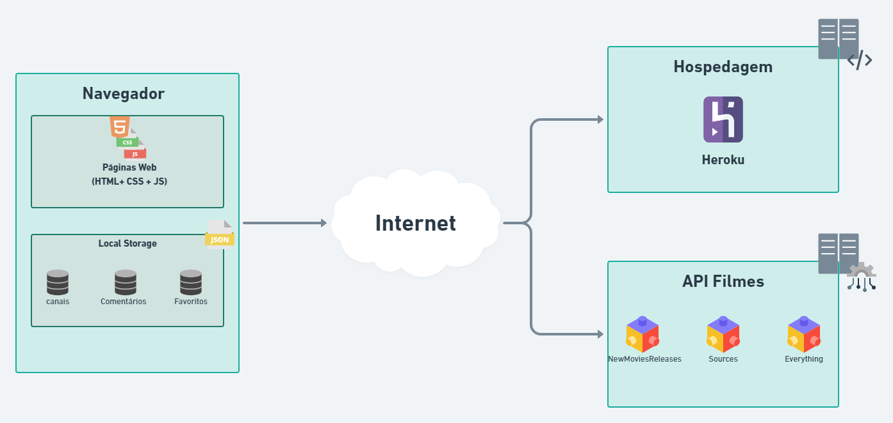
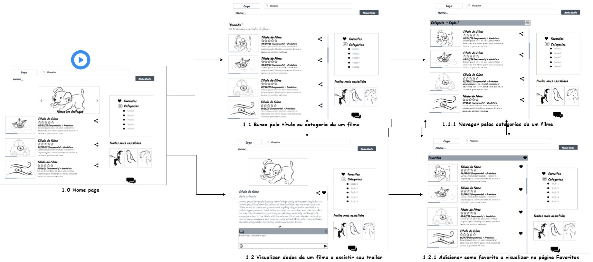
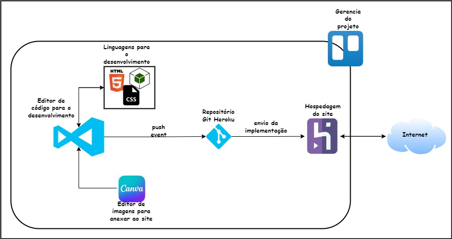

# Arquitetura da Solução

Pré-requisitos: <a href="04-Projeto de Interface.md"> Projeto de Interface</a>

Definição de como o software é estruturado em termos dos componentes que fazem parte da solução e do ambiente de hospedagem da aplicação. 

## Diagrama de componentes

Diagrama que permite a modelagem física de um sistema, através da visão dos seus componentes e relacionamentos entre os mesmos.

Exemplo: 

O diagrama apresentado abaixo (Figura 12) mostra os componentes que fazem parte da solução para o desenvolvimento do front-end da aplicação. 
Para visualizar o diagrama desenvolvido, acesse o ambiente [whimsical](https://whimsical.com/K9fDy81GPwhYqHiLwGC6m7).

Figura 12 - Arquitetura da Solução

A solução implementada para o front-end da aplicação, conta com os seguintes módulos:
- **Navegador** - Interface básica do sistema para acesso do usuário.
  - **Páginas Web** - Conjunto de arquivos HTML, CSS, JavaScript e imagens que implementam as funcionalidades do sistema.
   - **Local Storage** - armazenamento mantido no Navegador, onde são implementados bancos de dados baseados em JSON. São eles: 
     - **Canais** - seções de filmes apresentadas 
     - **Comentários** - registro de opiniões, interações dos usuários sobre as filmes.
     - **Favoritos** - lista de filmes salvos para rápida visualização e compartilhamento, mostrado no perfil.
 - **API Filmes** - plataforma que permite o acesso as informações e trailers dos filmes exibidos no site.
 - **Hospedagem** - local na Internet onde as páginas são mantidas e acessadas pelo navegador. 

## Diagrama de solução

Diagrama que permite analisar o fluxo de acesso de um usuário e, através da visão dos seus componentes e relacionamentos entre os mesmos.

A imagem a seguir ilustra a o fluxo do usuário em nossa solução. Assim
que o usuário entra no site, ele é apresentado à tela inicial
(Tela 1.0) onde ele é confrontado com as opões de pesquisar um título/categoria ou
então visualizar os dados um filme em destaque.

Caso ele opte por seguir pelo primeiro caminho (pesquisar um título/categoria), ele é
redirecionado para a tela de com os resultados da pesquisa (Tela 1.1), onde pode
encontrar um filme pela busca e ir para a página de visualizar os dados de um filme (Tela 1.2). 
Ao selecionar uma categoria na opção categorias, ele é redirecionado para a Tela 1.1.1, 
onde e mostrado os resultados de filmes por categoria.
Nessa tela, o usuário também pode escolher visualizar os favoritos. Ao selecionar essa opção, 
ele é redirecionado para a Tela 1.2.1, onde é mostrado ao usuário todos os filmes marcados com
o símbolo de coração (favoritos). 

Caso o usuário opte seguir pelo segundo caminho (visualizar os dados um filme em destaque) ele
é redirecionado para a Tela 1.2 com todas as informações sobre um determinado filme e seu trailer. O
usuário pode escolher visualizar os favoritos. Ao selecionar essa opção, 
ele é redirecionado para a Tela 1.2.1, onde é mostrado ao usuário todos os filmes marcados com
o símbolo de coração (favoritos). 
Nessa tela, o usuário também pode realizar uma pesquisa sendo redirecionado para a tela de com os
resultados da pesquisa (Tela 1.1), visualizando uma lista de filmes com a palavra digitada.

Figura 13 - Fluxo do usuário

## Tecnologias Utilizadas

Para implementar essa solução serão utilizados as seguintes tecnologias:
- **linguagens a serem utilizadas** 
  - [HTML](https://developer.mozilla.org/pt-BR/docs/Web/HTML)- Hypertext Markup Language (HTML) é o bloco de construção mais básico da web. Define o significado e a estrutura do conteúdo da web.
  - [CSS](https://developer.mozilla.org/pt-BR/docs/Web/CSS) - CSS é uma linguagem de estilo usada para descrever a apresentação de um documento escrito em HTML ou em XML.
  - [JS](https://developer.mozilla.org/pt-BR/docs/Web/JavaScript) - Java Script é uma linguagem leve, interpretada e baseada em objetos com funções de primeira classe, mais conhecida como a linguagem de script para páginas Web.

- **Serviços web**
  - [Trello](https://trello.com/home) - Trello é a ferramenta visual que possibilita ao time o gerenciamento de qualquer tipo de projeto, fluxo de trabalho ou monitoramento de tarefas.
  - [Heroku](https://www.heroku.com) - Heroku é uma plataforma de hospedagem em nuvem que permite que os clientes criem, entreguem, monitorem e dimensionem aplicativos.
  - [Canva](https://www.canva.com/pt_br/) - Canva é uma ferramenta online gratuita de design gráfico online que você pode usar para criar posts para redes sociais, apresentações, cartazes, vídeos, dentre outras.

- **Ferramentas** 
  - [VsCode](https://code-visualstudio-com.translate.goog/docs?_x_tr_sl=en&_x_tr_tl=pt&_x_tr_hl=pt-BR&_x_tr_pto=sc) - Visual Studio Code é um editor de código-fonte leve, mas poderoso, que é executado em sua área de trabalho e está disponível para Windows, macOS e Linux. Ele vem com suporte integrado a varias linguagens para criação de aplicações/softwares.
  - [Git](https://git-scm.com/docs/git/pt_BR) - O Git é um sistema de controle de revisão distribuído, rápido, escalável e com um conjunto de comandos incomumente rico que oferece operações de alto nível e acesso completo aos seus recursos.

A conexão entre as tecnologias utilizadas é representada na Figura 14.

Figura 14 - Tecnologias

## Hospedagem

Para realizar a hospedagem do site do projeto será utilizado a plataforma Heroku. A URL do site hospedado na ferramenta é:

[portalfilmespuc.herokuapp.com](https://portalfilmespuc.herokuapp.com/)

Para realizar a implantação, correções e modificações do site no Heroku, é utilizado um repositório no Git e adicionado um "push event" no Heroku.
Quando o projeto é submetido (push) via git aciona "push event" e realiza o lançamento do projeto versionado no repositório:

[Repositório portalFilmes](https://github.com/dgsilveira/portalFilmesPucAds)

