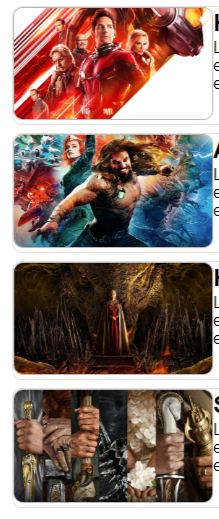

# Programação de Funcionalidades

<span style="color:red">Pré-requisitos: <a href="02-Especificação do Projeto.md"> Especificação do Projeto</a></span>, <a href="04-Projeto de Interface.md"> Projeto de Interface</a>, <a href="03-Metodologia.md"> Metodologia</a>,  <a href="05-Arquitetura da Solução.md"> Arquitetura da Solução</a>

Implementação do sistema descritas por meio dos requisitos funcionais e/ou não funcionais. Deve relacionar os requisitos atendidos os artefatos criados (código fonte) além das estruturas de dados utilizadas e as instruções para acesso e verificação da implementação que deve estar funcional no ambiente de hospedagem.

Para cada requisito funcional, pode ser entregue um artefato desse tipo

## Home Page (RF_01)

O site deve apresentar na página inicial as principais notícias.


### Requisito atendido:
> - RF_01

### Artefatos da funcionalidade
> - index.html
> - style.css
> - script.js
> - text.html

### Estrutura de Dados

- html
```html
<!DOCTYPE html>
<html lang="en">
<head>
    <meta charset="UTF-8">
    <meta http-equiv="X-UA-Compatible" content="IE=edge">
    <meta name="viewport" content="width=device-width, initial-scale=1.0">
    <title>Portal de Filmes</title>
    <link rel="stylesheet" href="style.css">
    <script src="script.js" defer></script>
    
    <meta name="copyright" content="@ Portal Filmes">
    <meta name="Keywords" content="filmes, notícias, series, lançamentos, cinema">
    <meta name="author" content="Andréa Silveira, Douglas Silveira, Marcelo Ferreira">
</head>
<body>
    <div class="wrapper">
        <header>            
            <a href="index.html"></a>
            
            <nav class="menu-superior">
                <div class="pesquisa">                    
                    <input type="text" id="txt-busca" placeholder="Pesquisar um filme, uma serie ou uma categoria...">
                    <button id="btn-busca">Buscar</button>
                </div>
                <div class="exemplo">
                    <ul>
                        <li>Ex:</li>
                        <li> vingadores,</li>
                        <li> o estranho mundo de Jack,</li>
                        <li> luta,</li>
                        <li> house of the dragons ...</li>
                    </ul> 
                </div> 
                <div class="opcao">
                    <ul>
                        <li><a href="/filmes/filmes.html">FILMES</a></li>
                        <li><a href="/filmes/series.html">SÉRIES</a></li>
                        <li><a href="noticias.html">NOTÍCIAS</a></li>
                        <li><a href="sobreNos.html">SOBRE NÓS</a></li>
                        <li><a href="Contato.html">CONTATO</a></li>
                        <li id="btn-login"><a href="entrar.html">MINHA CONTA</a></li>
                    </ul>
                    
                </div>               
            </nav>                      
        </header>
        
        <div class="tarja">
            <p>Fique por dentro dos filmes e séries do momento, curta, compartilhe e adicione amigos a sua rede, acesse <a href="entrar.html" style="color: rgb(204, 204, 6)">sua conta</a> e movimente nossa comunidade...</p> 
        </div>

        <div class="carrossel">
            <div class="container" id="img" class="hot">
                <div class="info-hot">
                    <a href="http://pucminas.br"></a>
                    <p>asahijdhaijksdhaisdhaijsdhiuasdhiuwqdiqwudghiasgdjhkasgdjkahsdgjashgdjkahs</p>
                </div>
                <a href="http://pucminas.br"></a>
                <a href="http://pucminas.br"></a>
                <a href="http://pucminas.br"></a>
            </div>
        </div>

        <aside>
            <div class="box-lateral">
                <a href="favoritos.html"><h2> &#x2661; FAVORITOS</h2></a> 
                <div class="categorias"><a href="#"><h2> &#8801; CATEGORIAS</h2></a>
                    <ul>
                        <li>cat1</li>
                        <li>cat2</li>
                        <li>cat3</li>
                        <li>cat4</li>
                        <li>cat5</li>
                    </ul>
                </div>
            </div>            
        </aside>

        <div class="content">
            
            <div class="box-filme">
                <a href="/filmes/filme_HF_Vespa.html"></a>
                <div class="info">
                    <h2>Homem-Formiga e a Vespa: Quantumania</h2>                
                    <p>Lorem ipsum dolor sit amet consectetur adipisicing elit. Blanditiis quia pariatur doloremque rem non ullam laboriosam porro tenetur eos odio recusandae sint suscipit sed eveniet et maxime sit, repellat voluptatum neque assumenda nobis. Laudantium, sapiente voluptates ducimus assumenda impedit nobis. Praesentium ratione facilis eligendi accusantium!</p>
                </div>
            </div>
            <div class="box-filme">
                <a href="/filmes/filme_AguaMan2.html"></a>
                <div class="info">
                    <h2>Aquaman 2</h2>
                    <p>Lorem ipsum dolor sit amet consectetur adipisicing elit. Blanditiis quia pariatur doloremque rem non ullam laboriosam porro tenetur eos odio recusandae sint suscipit sed eveniet et maxime sit, repellat voluptatum neque assumenda nobis. Laudantium, sapiente voluptates ducimus assumenda impedit nobis. Praesentium ratione facilis eligendi accusantium!</p>
                </div>
            </div>
            <div class="box-filme">
                <a href="/filmes/filme_HouseOfTheDragons.html"></a>
                <div class="info">
                    <h2>House of the Dragons</h2>
                    <p>Lorem ipsum dolor sit amet consectetur adipisicing elit. Blanditiis quia pariatur doloremque rem non ullam laboriosam porro tenetur eos odio recusandae sint suscipit sed eveniet et maxime sit, repellat voluptatum neque assumenda nobis. Laudantium, sapiente voluptates ducimus assumenda impedit nobis. Praesentium ratione facilis eligendi accusantium!</p>
                </div>
            </div>
            <div class="box-filme">
                <a href="/filmes/filme_AneisDoPoder.html"></a>
                <div class="info">
                    <h2>Senhor dos Aneis: Aneis do poder</h2>
                    <p>Lorem ipsum dolor sit amet consectetur adipisicing elit. Blanditiis quia pariatur doloremque rem non ullam laboriosam porro tenetur eos odio recusandae sint suscipit sed eveniet et maxime sit, repellat voluptatum neque assumenda nobis. Laudantium, sapiente voluptates ducimus assumenda impedit nobis. Praesentium ratione facilis eligendi accusantium!</p>
                </div>
            </div>
        </div>

        <footer>
            <p>@ copyright (2022) Portal de Filmes</p>
        </footer>
    </div>
    
</body>
</html>
```

- CSS
```CSS
*{
    box-sizing: border-box;
}

body {
    font-family: Arial, Helvetica, sans-serif;
    display: flex;
    align-items: center;
    justify-content: center;
    margin: 1;
    min-height: 100vh;
}

header { 
    place-self: center;
    grid-area: header;
    margin: 0; 
}

.carrossel { 
    grid-area: hot;    
    place-self: center;
    box-shadow: 2px 2px 4px black;
    overflow: hidden;   
    height: 450px;
    width: 900px; 
}

.container {
    display: flex;
    transition: transform 0.5s ease-in-out;
    transform: translateX(0);
}

.hot {   
    object-fit: cover;   
    height: 450px;
    max-height: 100%;
    width: 900px;    
}

.box {
    width: 200px; 
    border-radius: 10px; 
    border: 1px solid rgb(185, 183, 183);  
}

.content { grid-area: content; }
aside { grid-area: right; }

.wrapper {
    display: grid;
    grid-template-columns: 1fr 1fr 1fr 1fr;
    grid-template-rows: auto;
    grid-template-areas:
        "header header header header"
        "tarja tarja tarja tarja"
        "hot hot hot hot"
        "content content content right"
        "footer footer footer footer";
}

footer {
    grid-area: footer;
    vertical-align: bottom;    
    place-self: center;
}

.logo {
    width: 200px;
    float:left;
}

.menu-superior {
    float:left;    
    display: block;
}

.menu-superior > ul {
    list-style: none;
}

.pesquisa {
    margin-left: 40px;
    margin-top: 5px;
    background-color:#E0EEEE;
    border:solid 2px rgb(33, 163, 223);
    border-radius:10px;
    width:480px;
    height:32px;
}

#txt-busca{
    float:left;
    background-color:transparent;
    padding-left:5px;
    font-style:italic;
    font-size:15px;
    border:none;
    height:32px;
    width:400px;
}

#btn-busca {
    border:none;
    float:left;
    height:28px;
    border-radius:0 7px 7px 0;
    width: 76px;
    font-weight:bold;
    background:rgb(9, 165, 238);
}

#btn-login {
    float: right;
    border-radius: 7px;
    width: 200px;
    color: white;
    font-weight:bold;
    text-align: center;
    background:rgb(9, 165, 238);
    margin-left: 80px;
}

.exemplo > ul > li {
    display: inline-block; 
    font-size: 10px;     
}

.opcao {
    display: flex;    
    margin-top: 80px;
}

a {
    color: inherit;
    text-decoration: none;
}

.opcao > ul > li {
    display: inline-block;    
    color: rgb(243, 56, 56);  
    padding: 8px 9px 3px;
    font-size: 18px; 
}

.opcao > ul > li:hover {
    background: rgb(237, 235, 235); 
}

.tarja {
    
    grid-area: tarja;
}

.tarja p {
    margin-top: -17px;
    margin-left: -8px;
    margin-right: -8px;
    height:30px; 
    padding-top: 8px;
    text-align: center;
    color: white;
    font-weight: bold;
    text-align: center;
    background: rgb(243, 56, 56);
    box-shadow:0px 0px 5px #000000 inset;
}

aside > .box-lateral {    
    box-shadow:0px 0px 5px #0041f5 inset;
    margin-top: 5px;
    padding-bottom: 20px;
    text-align: center;
}

a > h2  {
    padding: 5px;
    margin: 0; 
    color: #0041f5; 
    color: white;
    background: rgb(9, 165, 238);
    box-shadow:0px 0px 5px #0041f5 inset;
}

.box-filme {
    display: flex;
    border: 1px solid rgb(228, 223, 223);
    border-radius: 10px;
    margin: 8px;
}

.box-filme p, .box-filme h2 {
    margin-top: 2px;
}

.box-filme h2 {
    margin-bottom: 0;
}

@media (max-width: 600px) {
    .wrapper {
        gap: 0;
        grid-template-columns: 1fr;
        grid-template-rows: auto auto auto auto 1fr auto;
        grid-template-areas:
            'header'
            'tarja'
            'hot'
            'right'
            'content'
            'footer';
    }
    .info > p {
        display: none;
    } 
}


```

- JavaScript
```javascript
const imgs = document.getElementById("img");
const img = document.querySelectorAll("#img img");

let idx = 0;

function carrossel(){
    idx++;

    if(idx > img.length - 1){
        idx = 0;
    }

    imgs.style.transform = `translateX(${-idx * 100}%)`;

}

setInterval(carrossel, 5800);
```


## Thumbnail (RF_02)

O site deve apresentar, para cada notícia, uma imagem correspondente ao assunto apresentado (thumbnail).



### Requisito atendido:
> - RF_02

### Artefatos da funcionalidade
> - index.html

### Estrutura de Dados

- html
```html
<div class="box-filme">
                <a href="/filmes/filme_HF_Vespa.html"></a>
                ...
            </div>
            <div class="box-filme">
                <a href="/filmes/filme_AguaMan2.html"></a>
                ...
            </div>
            <div class="box-filme">
                <a href="/filmes/filme_HouseOfTheDragons.html"></a>
                ...
            </div>
            <div class="box-filme">
                <a href="/filmes/filme_AneisDoPoder.html"></a>
                ...
            </div>
```

## Direcionamento de conteúdo (RF_03)
O site deve permitir ao usuário visualizar o texto completo da notícia com todos os detalhes da publicação.

Obs: ao clicar na notícia é redirecionado para a página com a notícia completa.

### Requisito Atendido:
> - RF_03

### Artefatos da funcionalidade
> - index.html

### Estrutura de Dados

-html
```html
<div class="box-filme">
                <a href="/filmes/filme_HF_Vespa.html"></a>
                ...
            </div>
            <div class="box-filme">
                <a href="/filmes/filme_AguaMan2.html"></a>
                ...
            </div>
            <div class="box-filme">
                <a href="/filmes/filme_HouseOfTheDragons.html"></a>
                ...
            </div>
            <div class="box-filme">
                <a href="/filmes/filme_AneisDoPoder.html"></a>
                ...
            </div>
```
## Pesquisa (RF_04)

O site deve oferecer uma funcionalidade de filtro/pesquisa para permitir ao usuário localizar um texto específico que será informado na caixa de pesquisa.


### Requisito atendido:
> - RF_04

### Artefatos da funcionalidade
> - index.html

### Estrutura de Dados

- html
```html
<div class="pesquisa">                    
    <input type="text" id="txt-busca" placeholder="Pesquisar um filme, uma serie ou uma categoria...">
    <button id="btn-busca">Buscar</button>
</div>
```
- CSS
```css
.pesquisa {
    margin-left: 40px;
    margin-top: 5px;
    background-color:#E0EEEE;
    border:solid 2px rgb(33, 163, 223);
    border-radius:10px;
    width:480px;
    height:32px;
}
```
## Contato (RF_05)
O site deve permitir entrar em contato com o mantenedor do site.

- Link contato na Home Page:

- Formulário de contato:


### Requisito atendido:
> - RF_05

### Artefatos da funcionalidade
> - index.html
> - style.css
> - script.js
> - text.html
> - contato.html
> - contato.css

### Estrutura de Dados

- html Contato HomePage
```html
<li><a href="Contato.html">CONTATO</a></li>
```
- html Formulário de Contato
```html
<!DOCTYPE html>
<html lang="en">
    <head>
		<meta charset="UTF-8">
        <meta http-equiv="X-UA-Compatible" content="IE=edge">
        <meta name="viewport" content="width=device-width, initial-scale=1.0">
        <title>Contato - PF</title>

        <link rel="stylesheet" href="reset.css">
        <link rel="stylesheet" href="/CSS/contato.css">

        <meta name="copyright" content="@ Portal Filmes">
        <meta name="Keywords" content="filmes, notícias, series, lançamentos, cinema">
        <meta name="author" content="Andréa Silveira, Douglas Silveira, Marcelo Ferreira">
	</head>
    <body>
        <header>
            <a href="index.html"></a>
            <nav class="menu-superior">
                <div class="pesquisa">                    
                    <input type="text" id="txt-busca" placeholder="Pesquisar um filme, uma serie ou uma categoria...">
                    <button id="btn-busca">Buscar</button>
                </div>
                <div class="exemplo">
                    <ul>
                        <li>Ex:</li>
                        <li> vingadores,</li>
                        <li> o estranho mundo de Jack,</li>
                        <li> luta,</li>
                        <li> house of the dragons ...</li>
                    </ul> 
                </div> 
                <div class="opcao">
                    <ul>
                        <li><a href="/filmes/filmes.html">Filmes</a></li>
                        <li><a href="/filmes/series.html">Séries</a></li>
                        <li><a href="sobreNos.html">Sobre Nós</a></li>
                        <li><a href="Contato.html">Contato</a></li>
                    </ul>
                    <button id="btn-login">Cadastre-se</button>
                </div>               
            </nav>            
        </header>

        <main class="main">
            <form>
				<label for="nomesobrenome">Nome e sobrenome</label>
				<input type="text" id="nomesobrenome" class="input-padrao" required>

				<label for="email">Email</label>
				<input type="email" id="email" class="input-padrao" required placeholder="seuemail@dominio.com">

				<label for="telefone">Telefone</label>
				<input type="tel" id="telefone" class="input-padrao" required placeholder="(XX) XXXXX-XXXX">

				<label for="mensagem">Mensagem</label>
				<textarea cols="70" rows="10" id="mensagem" class="input-padrao" required></textarea>

				<fieldset>
					<legend>Como prefere o nosso contato?</legend>
					<label for="radio-email"><input type="radio" name="contato" value="email" id="radio-email"> Email</label>
					
					<label for="radio-telefone"><input type="radio" name="contato" value="telefone" id="radio-telefone"> Telefone</label>
					
					<label for="radio-whatsapp"><input type="radio" name="contato" value="whatsapp" id="radio-whatsapp" checked> WhatsApp</label>
				</fieldset>

				<fieldset>
					<legend>Qual horário prefere ser atendido?</legend>
					<select>
						<option>Manhã</option>
						<option>Tarde</option>
						<option>Noite</option>
					</select>
				</fieldset>

				<label class="checkbox"><input type="checkbox" checked>Gostaria de receber nossas novidades por email?</label>

				<input type="submit" value="Enviar formulário" class="enviar">
			</form>

            <table>
				<tr>
					<td>Dia</td>
					<td>Horário</td>
				</tr>
				<tr>
					<td>Segunda</td>
					<td>8h ~ 20h</td>
				</tr>
				<tr>
					<td>Quarta</td>
					<td>8h ~ 20h</td>
				</tr>
				<tr>
					<td>Sexta</td>
					<td>8h ~ 20h</td>
				</tr>
			</table>


        </main>
    </body>
</html>

```

- Css Formulário de Contato
```css
/* Parte Superior */
*{
    box-sizing: border-box;
}

.logo {
    width: 200px;
    float:left;
}

.menu-superior {
    float:left;
    display: block;
}

.menu-superior > ul {
    list-style: none;
    padding: 5px;
}

.pesquisa {
    margin-left: 40px;
    margin-top: 5px;
    background-color:#E0EEEE;
    border:solid 2px rgb(33, 163, 223);
    border-radius:10px;
    width:480px;
    height:32px;
}

#txt-busca{
    float:left;
    background-color:transparent;
    padding-left:5px;
    font-style:italic;
    font-size:15px;
    border:none;
    height:32px;
    width:400px;
}

#btn-busca {
    border:none;
    float:left;
    height:28px;
    border-radius:0 7px 7px 0;
    width: 76px;
    font-weight:bold;
    background:rgb(9, 165, 238);
}

#btn-login {
    border:none;
    float:left;
    height:32px;
    border-radius: 7px;
    width: 200px;
    color: white;
    font-weight:bold;
    font-size: 20px;
    background:rgb(9, 165, 238);
}

.exemplo > ul > li {
    display: inline-block;
    font-size: 10px;
}


body {
    font-family: Arial, Helvetica, sans-serif;
}

body > header{
    display: flex;
    align-items: center;
    justify-content: center;
    margin: 1;
    min-height: 30vh;
}

header {
    place-self: center;
    grid-area: header;
    margin: 0; 
}

/* Formulário */

main{
    margin: 10px;
}
.opcao {
    display: flex;
    margin-top: 80px;
}

.opcao > ul > li {
    display: inline-block;
    padding: 15px;
    margin-top: -50px;
}

.opcao > ul > li:hover {
    background: rgb(33, 163, 223);
    color: white;
}

form {
	margin: 40px 0;
}

form label, form legend {
	display:block;
	font-size: 20px;
	margin: 0 0 10px;
}

.input-padrao {
	display: block;
	margin: 0 0 20px;
	padding: 10px 25px;
	width: 50%;
}

.checkbox {
	margin: 20px 0;
}

.enviar {
	width:40%;
	padding: 15px 0;
	background: orange;
	color: white;
	font-weight: bold;
	font-size: 18px;
	border: none;
	border-radius: 5px;
	transition: 1s all;
	cursor: pointer;
}

.enviar:hover {
	background: darkorange;
	transform: scale(1.2);
}

table {
	margin: 20px 0 40px;
}

thead {
	background: #555555;
	color: white;
	font-weight: bold;
}

td, th {
	border: 1px solid #000000;
	padding: 8px 15px;
}


```
